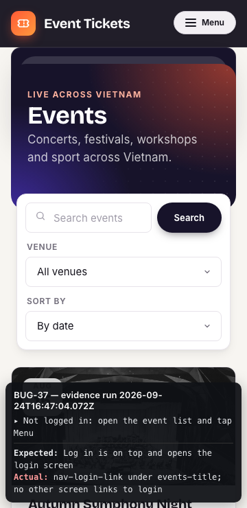

# Bug list

## Summary

37 bugs: 6 Critical, 9 High, 12 Medium, 10 Low. They come from 9 root-cause groups, so the fix work is smaller than the count suggests. What matters most:

- **Missing server-side checks on who may act.** Any customer can edit an event (BUG-01) and read or cancel any other customer's order (BUG-02, BUG-03). The observed behaviour suggests small, missing server-side guards (a hypothesis: no source was available); they should be fixed first.
- **Business rules enforced in the UI or not at all.** Pricing (BUG-05 to BUG-07), quantities and caps (BUG-04, BUG-08), past events, refunds, repeat cancels and the cart hold (BUG-09 to BUG-12) are not enforced by the API.
- On phones a visitor cannot even log in or sign up, because the menu opens behind the page (BUG-37), and a logged-in buyer cannot reach quantity or Add (BUG-25).

Environment: https://candidate-01.207.148.118.135.sslip.io, API per /docs/json (eve-qa-interview API 1.0.0). Chrome (Playwright 1.63 Chromium), desktop 1280x800 and phone 360x740. Browser time zone Europe/London so Vietnam-time conversion is visible. Fresh accounts registered per run. Test email addresses end in @example.invalid on purpose: .invalid is a top-level domain reserved so that it never resolves (RFC 2606, RFC 6761), so the addresses are well-formed but no mail can reach a real person. The brief's own accounts use the same domain. The name does not mean the input is invalid: the malformed-email cases (BUG-17) are broken in their syntax, e.g. 'not-an-email-…' (no @), 'a…@b' and 'qa-…@@example.invalid' (two @ signs).

Effort (S/M/L) is my estimate from the observed behaviour, without the source code. Severity scale (who is harmed and how much): **Critical** Money, security or the core purchase is broken for many users; no workaround; **High** A business rule in the brief is broken with real harm to buyers or the business; **Medium** A rule is broken with limited harm or an easy workaround; **Low** Cosmetic, validation or consistency issue with little harm.

Evidence: each bug links its newest complete recording run, `assets/BUG-xx/<YYYYMMDDTHHmmssSSS>/`: `recording.webm` (video), `screenshot.png`, `network.har` (API traffic, cookies and tokens redacted) and `log.json` (every API request and response of the run). For bugs marked **API**, `log.json` is the primary evidence and the screenshot shows the on-screen request log. Causes are written as **hypotheses**: without the source code, only the observed behaviour is fact.

## All bugs, most severe first

| Id | Severity | Title | Root-cause group | Effort |
|---|---|---|---|---|
| [BUG-01](#bug-01) | Critical | Any customer can edit any event through PUT /api/events/{id} | Authorisation: admin role guard | S |
| [BUG-02](#bug-02) | Critical | A customer can cancel another customer's order | Authorisation: order ownership | S |
| [BUG-03](#bug-03) | Critical | A customer can read another customer's order, including recipient name and phone | Authorisation: order ownership | S |
| [BUG-05](#bug-05) | Critical | The same discount code can be applied repeatedly and stacks | Pricing pipeline | S |
| [BUG-25](#bug-25) | Critical | At 360 px the quantity field and Add button are off screen, so tickets cannot be bought on a phone | Frontend rendering | S |
| [BUG-37](#bug-37) | Critical | On a phone, the opened menu is hidden behind the page, so a visitor cannot reach Log in or Sign up | Frontend rendering | S |
| [BUG-04](#bug-04) | High | Adding 0 or a negative quantity to the cart is accepted, producing negative totals | Cart line rules | S |
| [BUG-06](#bug-06) | High | Discount codes also reduce VIP and Student tickets | Pricing pipeline | S |
| [BUG-07](#bug-07) | High | Service fee is charged on the subtotal before the discount | Pricing pipeline | S |
| [BUG-09](#bug-09) | High | Past events can be booked through the API | Order preconditions | S |
| [BUG-10](#bug-10) | High | Cancelling after the event started refunds 100% instead of 0% | Order preconditions | S |
| [BUG-11](#bug-11) | High | A cancelled order can be cancelled again, and each cancel returns its tickets to stock again | Order preconditions | S |
| [BUG-13](#bug-13) | High | Sessions do not expire after 30 minutes | Session | S |
| [BUG-21](#bug-21) | High | Search only matches the start of the event name: 'rock' finds nothing | Events list query | S |
| [BUG-27](#bug-27) | High | Event detail shows the UTC date and no time, not Vietnam time | Frontend rendering | S |
| [BUG-08](#bug-08) | Medium | VIP cap lets 5 VIP tickets into one order (off by one) | Cart line rules | S |
| [BUG-12](#bug-12) | Medium | Checkout still succeeds after the 10 minute cart hold has lapsed | Order preconditions | S |
| [BUG-15](#bug-15) | Medium | Checkout accepts phone numbers with fewer than 10 digits or no digits | Input validation | S |
| [BUG-17](#bug-17) | Medium | Registration accepts malformed email addresses | Input validation | S |
| [BUG-19](#bug-19) | Medium | The same email can register a second account by adding a leading space | Input validation | S |
| [BUG-23](#bug-23) | Medium | Sort by name sorts each page on its own, not the whole list | Events list query | M |
| [BUG-24](#bug-24) | Medium | Paging repeats the last event of each page at the top of the next page | Events list query | S |
| [BUG-31](#bug-31) | Medium | Admin event screen renders for a customer, with Create and edit controls | Authorisation: admin role guard | S |
| [BUG-33](#bug-33) | Medium | 'Added to cart' stays on screen next to the error of a later failed add | Frontend rendering | S |
| [BUG-34](#bug-34) | Medium | Removing the last cart line leaves the old total on screen | Frontend rendering | S |
| [BUG-35](#bug-35) | Medium | Cart line names are clipped, hiding which ticket type each line is | Frontend rendering | S |
| [BUG-36](#bug-36) | Medium | My orders offers 'Cancel tickets' on orders that are already cancelled | Order preconditions | S |
| [BUG-14](#bug-14) | Low | Recipient names over 50 characters are silently truncated instead of refused | Input validation | S |
| [BUG-16](#bug-16) | Low | Checkout accepts a blank recipient name | Input validation | S |
| [BUG-18](#bug-18) | Low | Phone numbers made of letters are accepted at registration and in the profile | Input validation | S |
| [BUG-20](#bug-20) | Low | New password equal to the current one is accepted | Input validation | S |
| [BUG-22](#bug-22) | Low | Search treats % and _ as wildcards and returns every event | Events list query | S |
| [BUG-26](#bug-26) | Low | Profile screen scrolls sideways at 360 px when the email has no break point | Frontend rendering | S |
| [BUG-28](#bug-28) | Low | Checkout 'Phone number' label focuses the recipient field | Frontend rendering | S |
| [BUG-29](#bug-29) | Low | Search, discount code and cart quantity fields have no visible label | Frontend rendering | S |
| [BUG-30](#bug-30) | Low | Order confirmation shows the total as a bare number | Frontend rendering | S |
| [BUG-32](#bug-32) | Low | Next stays enabled on the last page and opens an empty 'page 4 of 3' | Frontend rendering | S |

## Root-cause groups (suggested fix order)

- **Authorisation: admin role guard**: BUG-01 (Critical), BUG-31 (Medium)
- **Authorisation: order ownership**: BUG-02 (Critical), BUG-03 (Critical)
- **Cart line rules**: BUG-04 (High), BUG-08 (Medium)
- **Pricing pipeline**: BUG-05 (Critical), BUG-06 (High), BUG-07 (High)
- **Order preconditions**: BUG-09 (High), BUG-10 (High), BUG-11 (High), BUG-12 (Medium), BUG-36 (Medium)
- **Session**: BUG-13 (High)
- **Input validation**: BUG-15 (Medium), BUG-17 (Medium), BUG-19 (Medium), BUG-14 (Low), BUG-16 (Low), BUG-18 (Low), BUG-20 (Low)
- **Events list query**: BUG-21 (High), BUG-23 (Medium), BUG-24 (Medium), BUG-22 (Low)
- **Frontend rendering**: BUG-25 (Critical), BUG-37 (Critical), BUG-27 (High), BUG-33 (Medium), BUG-34 (Medium), BUG-35 (Medium), BUG-26 (Low), BUG-28 (Low), BUG-29 (Low), BUG-30 (Low), BUG-32 (Low)

## BUG-01

**Any customer can edit any event through PUT /api/events/{id}**

| | |
|---|---|
| Severity | Critical |
| Status | Open |
| Area | Administration (API) |
| Requirement | REQ-ADM-01 |
| Found by | TC-ADM-04 |
| Who is harmed | Every buyer and the organiser: the route accepts an edit from any customer. A real edit was deliberately not sent, so renaming or re-dating is inferred from the accepted request, not demonstrated. |
| Why this severity | Critical: a customer can use an administrator-only operation that changes what every buyer sees (dates, venues), which the brief forbids "by any route". Rated on the accepted request; no real edit was sent, to protect the shared site. |
| Root-cause group | Authorisation: admin role guard |
| Likely location | Server: PUT /api/events/{id} route handler has no admin guard (POST, DELETE and the other admin routes do) |
| Effort (estimate) | S |
| Related | BUG-31 |

**Steps to reproduce**

1. Register and log in as an ordinary customer
2. GET /api/events/7 and keep its slug, title, venue and startsAt
3. PUT /api/events/7 with exactly those values (an edit that changes nothing)
4. Send POST /api/events (reusing that event's slug) and the other admin routes from the same session for comparison

**Expected:** 403 'Administrator access required', as POST, DELETE and every other admin route return

**Actual:** 200 with the event returned, while POST /api/events, DELETE /api/events/999999, PATCH /api/ticket-types/{id}, GET /api/admin/orders, GET /api/admin/orders.csv and DELETE /api/admin/orders/{id} all return 403 for the same customer. Only the edit route lacks the guard. Probed with the event's unchanged body, so no shared data was changed.

**Hypothesis (not verified against source):** The route is missing the role check the other admin routes share.

**Note:** Combined with BUG-31 the admin event screen is also reachable in the UI.

**Evidence** (run 20260924T141727834, reproduced: PUT 200; POST /api/events 403, DELETE /api/events/999999 403, PATCH /api/ticket-types/{id} 403, GET /api/admin/orders 403, GET /api/admin/orders.csv 403, DELETE /api/admin/orders/999999 403): [recording.webm](./assets/BUG-01/20260924T141727834/recording.webm) · [screenshot.png](./assets/BUG-01/20260924T141727834/screenshot.png) · [network.har](./assets/BUG-01/20260924T141727834/network.har) · [log.json](./assets/BUG-01/20260924T141727834/log.json)

## BUG-02

**A customer can cancel another customer's order**

| | |
|---|---|
| Severity | Critical |
| Status | Open |
| Area | Orders (API) |
| Requirement | REQ-SEC-01 |
| Found by | TC-ORD-04 |
| Who is harmed | Every buyer can lose their tickets to anyone; the business refunds orders nobody asked to cancel. |
| Why this severity | Critical: any customer can destroy any other customer's purchase, and sequential ids make every order reachable. Harm to many buyers, no workaround for the victim. |
| Root-cause group | Authorisation: order ownership |
| Likely location | Server: POST /api/orders/{id}/cancel loads the order by id without matching it to the session user |
| Effort (estimate) | S |
| Related | BUG-03, BUG-11 |

**Steps to reproduce**

1. Buyer A adds 1 Standard of event 7 and checks out; note order id N
2. Buyer B (a different fresh account) sends POST /api/orders/N/cancel
3. Buyer A sends GET /api/orders/N

**Expected:** B gets 403 or 404; A's order stays CONFIRMED

**Actual:** B gets 200 and A's order is CANCELLED with a refund; order ids are sequential, so every order on the site can be cancelled

**Hypothesis (not verified against source):** No order.userId === session.userId check.

**Evidence** (run 20260924T141727834, reproduced: B cancel -> 200 CANCELLED): [recording.webm](./assets/BUG-02/20260924T141727834/recording.webm) · [screenshot.png](./assets/BUG-02/20260924T141727834/screenshot.png) · [network.har](./assets/BUG-02/20260924T141727834/network.har) · [log.json](./assets/BUG-02/20260924T141727834/log.json)

## BUG-03

**A customer can read another customer's order, including recipient name and phone**

| | |
|---|---|
| Severity | Critical |
| Status | Open |
| Area | Orders (API) |
| Requirement | REQ-SEC-01 |
| Found by | TC-ORD-03 |
| Who is harmed | Every buyer: name, phone and student card number of any order are readable by any logged-in user, and ids are sequential, so every order can be enumerated. Same flaw as BUG-02, so the same severity. |
| Why this severity | Critical: personal data (name, phone, student card) of every buyer is readable by any logged-in user through sequential ids. Same missing ownership check as BUG-02. |
| Root-cause group | Authorisation: order ownership |
| Likely location | Server: GET /api/orders/{id} loads the order by id without matching it to the session user |
| Effort (estimate) | S |
| Related | BUG-02 |

**Steps to reproduce**

1. Buyer A checks out; note order id N
2. Buyer B sends GET /api/orders/N

**Expected:** 403 or 404

**Actual:** 200 with A's recipientName, phone, studentCardNo and amounts; ids are sequential so all orders can be enumerated

**Hypothesis (not verified against source):** Same missing ownership check as BUG-02.

**Evidence** (run 20260924T141727834, reproduced: B read -> 200): [recording.webm](./assets/BUG-03/20260924T141727834/recording.webm) · [screenshot.png](./assets/BUG-03/20260924T141727834/screenshot.png) · [network.har](./assets/BUG-03/20260924T141727834/network.har) · [log.json](./assets/BUG-03/20260924T141727834/log.json)

## BUG-05

**The same discount code can be applied repeatedly and stacks**

| | |
|---|---|
| Severity | Critical |
| Status | Open |
| Area | Pricing (API) |
| Requirement | REQ-DISC-02 |
| Found by | TC-DISC-03, TC-DISC-08 |
| Who is harmed | Business revenue: any buyer can reach 100% off Standard tickets by repeating one request. |
| Why this severity | Critical: direct revenue loss without limit; repeating one request reaches 100% off Standard tickets and the stacked discount is saved on the order. |
| Root-cause group | Pricing pipeline |
| Likely location | Server: POST /api/cart/discount appends the code to a list instead of replacing or refusing |
| Effort (estimate) | S |
| Related | BUG-06, BUG-07 |

**Steps to reproduce**

1. Add 2 Standard (100,000 each) of event 7
2. POST /api/cart/discount {code: 'WELCOME10'}
3. POST the same code again
4. POST it a third time
5. Check out

**Expected:** The second apply is refused or ignored; discount stays 20,000; one code on the order

**Actual:** discountCode becomes 'WELCOME10,WELCOME10,WELCOME10' and discount grows 20,000, 40,000, 60,000; the stacked discount is saved on the confirmed order

**Hypothesis (not verified against source):** Codes are concatenated ("WELCOME10,WELCOME10") and each entry is applied.

**Evidence** (run 20260924T141727834, reproduced: code WELCOME10,WELCOME10,WELCOME10): [recording.webm](./assets/BUG-05/20260924T141727834/recording.webm) · [screenshot.png](./assets/BUG-05/20260924T141727834/screenshot.png) · [network.har](./assets/BUG-05/20260924T141727834/network.har) · [log.json](./assets/BUG-05/20260924T141727834/log.json)

## BUG-25

**At 360 px the quantity field and Add button are off screen, so tickets cannot be bought on a phone**

| | |
|---|---|
| Severity | Critical |
| Status | Open |
| Area | Screens (UI) |
| Requirement | REQ-UI-01 |
| Found by | TC-UI-01 |
| Who is harmed | Every buyer on a phone: the purchase flow cannot be completed at 360 px, which the brief names explicitly. |
| Why this severity | Critical: on a 360 px phone the buyer cannot reach quantity or Add, so the core purchase is impossible on the device class the brief names explicitly. |
| Root-cause group | Frontend rendering |
| Likely location | Frontend: event detail ticket list (class "ticket-list is-tabular", flag f31) (bundle flag `f31`) |
| Effort (estimate) | S |
| Related | BUG-26, BUG-37 |

**Steps to reproduce**

1. Open an upcoming event on a 360 px wide phone screen
2. Look at a ticket card

**Expected:** Quantity and Add are visible and usable without zoom or sideways scrolling

**Actual:** The card clips its contents: price is cut off, quantity starts at x=428 and Add at x=585, beyond the 360 px screen. Page scrollWidth stays 360, so the controls cannot be reached at all

**Hypothesis (not verified against source):** A fixed 4-column grid (11rem 8rem 9rem 9rem) with overflow hidden cannot fit 360 px.

**Note:** Confirmed on a real iPhone 15 Pro Max and in the browser's phone emulation. Also reproduced on WebKit with the iPhone 13 profile (project mobile-webkit).

**Evidence** (run 20260924T141727834, reproduced: x=585.109375): [recording.webm](./assets/BUG-25/20260924T141727834/recording.webm) · [screenshot.png](./assets/BUG-25/20260924T141727834/screenshot.png) · [network.har](./assets/BUG-25/20260924T141727834/network.har) · [log.json](./assets/BUG-25/20260924T141727834/log.json)

## BUG-37

**On a phone, the opened menu is hidden behind the page, so a visitor cannot reach Log in or Sign up**

| | |
|---|---|
| Severity | Critical |
| Status | Open |
| Area | Screens (UI) |
| Requirement | REQ-UI-01 |
| Found by | TC-UI-18, TC-UI-19 |
| Who is harmed | Every visitor on a phone or tablet in portrait: they cannot log in or register, so they cannot buy at all; logged-in buyers cannot reach the cart, their orders or their profile from the menu. |
| Why this severity | Critical: below 1024 px a visitor who is not logged in has no tappable route to Log in or Sign up, so no purchase can start on a phone. The only way in is typing /login into the address bar, which an ordinary buyer would not know, so it is not counted as a workaround. Raised from High after the logged-out case was checked (the first report covered logged-in buyers only). |
| Root-cause group | Frontend rendering |
| Likely location | Frontend: app header (class 'app-header is-flat' sets z-index auto, flag f30) (bundle flag `f30`) |
| Effort (estimate) | S |
| Related | BUG-25 |

**Steps to reproduce**

1. Open the site on a 360 px screen without logging in
2. Tap Menu
3. Tap Log in

**Expected:** The login screen opens (and, once logged in, Cart, My orders and Profile in the menu can be tapped)

**Actual:** The menu panel opens under the page: at the centre of Log in the topmost element is the page title 'Events', so the tap lands on the title and nothing happens. The same holds at every width below 1024 px (360 to 820 px checked), on Chromium and on WebKit (iPhone 15 Pro Max profile). No other screen links to login: the event detail, cart and orders screens have none, and Sign up exists only on the login screen. Logged in, Cart, My orders and Profile in the menu are covered the same way

**Hypothesis (not verified against source):** CSS: z-index auto lets page content stack above the header's menu panel.

**Note:** Confirmed on a real iPhone 15 Pro Max and in the browser's phone emulation, logged out and logged in. Also reproduced on WebKit with the iPhone 13 and iPhone 15 Pro Max profiles.

**Evidence** (run 20260924T234702932, reproduced: nav-login-link under events-title; nav-cart-link under none; nav-my-orders-link under event-detail-title; nav-profile-link under event-detail-title): [recording.webm](./assets/BUG-37/20260924T234702932/recording.webm) · [screenshot.png](./assets/BUG-37/20260924T234702932/screenshot.png) · [network.har](./assets/BUG-37/20260924T234702932/network.har) · [log.json](./assets/BUG-37/20260924T234702932/log.json)

## BUG-04

**Adding 0 or a negative quantity to the cart is accepted, producing negative totals**

| | |
|---|---|
| Severity | High |
| Status | Open |
| Area | Booking (API) |
| Requirement | REQ-BOOK-01 |
| Found by | TC-CART-02, TC-CART-03 |
| Who is harmed | Business: negative lines can offset other lines in the price. Checkout of a negative cart was deliberately not attempted, because it would change shared stock. |
| Why this severity | High: a stated booking rule is broken and the cart total goes negative; not Critical because checkout of a negative cart was not attempted, so the money effect is shown only in the cart. |
| Root-cause group | Cart line rules |
| Likely location | Server: POST /api/cart/items body schema (quantity has no minimum); negative PATCH is already refused |
| Effort (estimate) | S |
| Related | BUG-08 |

**Steps to reproduce**

1. Log in as a fresh buyer
2. POST /api/cart/items {ticketTypeId: <Standard of event 7>, quantity: 0}
3. POST the same with quantity -1
4. GET /api/cart

**Expected:** Both adds rejected with 400 ("Each add is a whole number of at least 1"); cart empty. Removing a line with PATCH quantity 0 is a separate, legitimate action and is not part of this bug.

**Actual:** Both return 200; the cart holds quantity -1 with gross -100,000, serviceFee -5,000, total -105,000

**Hypothesis (not verified against source):** The add schema allows any integer; PATCH refuses negatives, so only the add path is affected.

**Evidence** (run 20260924T141727834, reproduced: total -105000): [recording.webm](./assets/BUG-04/20260924T141727834/recording.webm) · [screenshot.png](./assets/BUG-04/20260924T141727834/screenshot.png) · [network.har](./assets/BUG-04/20260924T141727834/network.har) · [log.json](./assets/BUG-04/20260924T141727834/log.json)

## BUG-06

**Discount codes also reduce VIP and Student tickets**

| | |
|---|---|
| Severity | High |
| Status | Open |
| Area | Pricing (API) |
| Requirement | REQ-DISC-01 |
| Found by | TC-DISC-04, TC-DISC-05, TC-DISC-06, TC-DISC-15 |
| Who is harmed | Business revenue on the highest-priced tickets. |
| Why this severity | High: revenue lost on the most expensive tickets on every discounted VIP or Student line; rests on reading GAP-09 ("Standard only"). |
| Root-cause group | Pricing pipeline |
| Likely location | Server: cart totals function applies the discount to the whole subtotal, not the Standard lines |
| Effort (estimate) | S |
| Related | BUG-05, BUG-07 |

**Steps to reproduce**

1. Add 1 VIP (300,000) of event 7
2. Apply WELCOME10
3. Read the cart

**Expected:** discount 0, because codes apply to Standard tickets only; total 315,000

**Actual:** discount 30,000 (10% of the VIP ticket); the same happens for Student tickets

**Hypothesis (not verified against source):** No filter on ticket type before the discount is computed.

**Note:** The brief says "Discount codes apply to Standard tickets". I read that as Standard tickets only (GAP-09); if the product owner reads it otherwise, this bug and TC-DISC-04/05 change.

**Evidence** (run 20260924T141727834, reproduced: discount 30000): [recording.webm](./assets/BUG-06/20260924T141727834/recording.webm) · [screenshot.png](./assets/BUG-06/20260924T141727834/screenshot.png) · [network.har](./assets/BUG-06/20260924T141727834/network.har) · [log.json](./assets/BUG-06/20260924T141727834/log.json)

## BUG-07

**Service fee is charged on the subtotal before the discount**

| | |
|---|---|
| Severity | High |
| Status | Open |
| Area | Pricing (API + UI) |
| Requirement | REQ-PRICE-01 |
| Found by | TC-DISC-07, TC-DISC-06, TC-DISC-08, TC-DISC-10, TC-DISC-12, TC-DISC-14, TC-DISC-16 |
| Who is harmed | Every buyer who uses a code is overcharged 5% of the discount; the brief calls this order of operations out explicitly. |
| Why this severity | High: every buyer who uses a code is overcharged, and the brief states this order of operations explicitly ("on what is left after the discount"). Small per order but systematic, and it is the buyer's money. |
| Root-cause group | Pricing pipeline |
| Likely location | Server: cart totals function computes the fee from gross instead of gross minus discount |
| Effort (estimate) | S |
| Related | BUG-05, BUG-06 |

**Steps to reproduce**

1. Add 2 Standard (100,000 each)
2. Apply WELCOME10
3. Read serviceFee and total

**Expected:** discount 20,000; fee 5% of 180,000 = 9,000; total 189,000

**Actual:** discount 20,000; fee 10,000 (5% of 200,000); total 190,000. Same numbers in the cart UI and on the order

**Hypothesis (not verified against source):** fee = 5% × gross.

**Evidence** (run 20260924T141727834, reproduced: fee 10000 = 5% of gross 200000; spec 9000): [recording.webm](./assets/BUG-07/20260924T141727834/recording.webm) · [screenshot.png](./assets/BUG-07/20260924T141727834/screenshot.png) · [network.har](./assets/BUG-07/20260924T141727834/network.har) · [log.json](./assets/BUG-07/20260924T141727834/log.json)

## BUG-09

**Past events can be booked through the API**

| | |
|---|---|
| Severity | High |
| Status | Open |
| Area | Booking (API) |
| Requirement | REQ-BOOK-07 |
| Found by | TC-CHK-11 |
| Who is harmed | Buyers pay for an event that already happened; refunds and complaints follow. |
| Why this severity | High: buyers are charged for an event that has already happened; the UI hides it, so only direct API callers are affected today. |
| Root-cause group | Order preconditions |
| Likely location | Server: POST /api/cart/items and POST /api/orders do not check event status |
| Effort (estimate) | S |
| Related | BUG-10 |

**Steps to reproduce**

1. GET /api/events/11 (Autumn Symphony Night, status PAST)
2. POST /api/cart/items with its Standard ticket type
3. POST /api/orders

**Expected:** The add or the checkout is refused

**Actual:** Both succeed; order CONFIRMED for an event that ended on 15 Aug 2026. The UI hides the Add buttons, so only the server check is missing

**Hypothesis (not verified against source):** The UI hides Add for past events; the server never checks.

**Evidence** (run 20260924T141727834, reproduced: CONFIRMED): [recording.webm](./assets/BUG-09/20260924T141727834/recording.webm) · [screenshot.png](./assets/BUG-09/20260924T141727834/screenshot.png) · [network.har](./assets/BUG-09/20260924T141727834/network.har) · [log.json](./assets/BUG-09/20260924T141727834/log.json)

## BUG-10

**Cancelling after the event started refunds 100% instead of 0%**

| | |
|---|---|
| Severity | High |
| Status | Open |
| Area | Refunds (API) |
| Requirement | REQ-REF-03 |
| Found by | TC-CAN-03 |
| Who is harmed | Business revenue: every post-event cancellation is fully refunded. The 50% tier could not be tested (GAP-08). |
| Why this severity | High: every post-start cancellation is refunded in full, against a stated refund rule; depends on BUG-09 for its only reproduction. |
| Root-cause group | Order preconditions |
| Likely location | Server: refund-tier function (cancel handler) |
| Effort (estimate) | S |
| Related | BUG-09 |

**Steps to reproduce**

1. Book the past event 11 through the API (only possible because of BUG-09)
2. Open My orders
3. Click Cancel tickets on that order
4. Read refundAmount

**Expected:** refundAmount 0 ("After the start: 0%")

**Actual:** refundAmount equals the full totalAmount (e.g. 420,000 of 420,000)

**Hypothesis (not verified against source):** Refund appears to be 100% whatever the time to start; the 0% tier is never reached.

**Note:** Depends on BUG-09 for its only reproduction. The real-world scenario (booked before the start, cancelled after it) needs an event that starts during the test; only an administrator can create one. Once BUG-09 is fixed, re-test with such a fixture before closing.

**Evidence** (run 20260924T141727834, reproduced: refund 420000): [recording.webm](./assets/BUG-10/20260924T141727834/recording.webm) · [screenshot.png](./assets/BUG-10/20260924T141727834/screenshot.png) · [network.har](./assets/BUG-10/20260924T141727834/network.har) · [log.json](./assets/BUG-10/20260924T141727834/log.json)

## BUG-11

**A cancelled order can be cancelled again, and each cancel returns its tickets to stock again**

| | |
|---|---|
| Severity | High |
| Status | Open |
| Area | Orders (API) |
| Requirement | REQ-INV-01 |
| Found by | TC-CAN-02 |
| Who is harmed | Organiser and buyers: stock inflates past capacity, so the event oversells. |
| Why this severity | High: stock grows past capacity with each repeated cancel, so the event can oversell; reachable in one click through BUG-36. |
| Root-cause group | Order preconditions |
| Likely location | Server: POST /api/orders/{id}/cancel has no CONFIRMED check before restocking |
| Effort (estimate) | S |
| Related | BUG-36, BUG-02 |

**Steps to reproduce**

1. Buy 1 Standard ticket of a quiet event and note remaining R after the purchase
2. Cancel the order: remaining returns to R + 1
3. Cancel the same order again
4. Read remaining

**Expected:** The second cancel is refused (4xx) and remaining stays at R + 1

**Actual:** The second cancel returns 200 and remaining rises by 1 again, to R + 2. Each extra cancel adds the order's quantity once more, so stock grows past the event's capacity. The recorded run shows the exact numbers.

**Hypothesis (not verified against source):** Cancel restocks unconditionally. The UI offers the button on cancelled orders too (BUG-36).

**Evidence** (run 20260924T141727834, reproduced: R 603; after cancel 604; second cancel 200; after second cancel 605): [recording.webm](./assets/BUG-11/20260924T141727834/recording.webm) · [screenshot.png](./assets/BUG-11/20260924T141727834/screenshot.png) · [network.har](./assets/BUG-11/20260924T141727834/network.har) · [log.json](./assets/BUG-11/20260924T141727834/log.json)

## BUG-13

**Sessions do not expire after 30 minutes**

| | |
|---|---|
| Severity | High |
| Status | Open |
| Area | Accounts (API) |
| Requirement | REQ-ACC-06 |
| Found by | TC-AUTH-06, TC-AUTH-03 |
| Who is harmed | Every buyer on a shared device: an abandoned session stays usable; a leaked cookie never ages out. |
| Why this severity | High: a stated security rule (30-minute expiry) is not enforced, so an abandoned or leaked session stays usable indefinitely. |
| Root-cause group | Session |
| Likely location | Server: session middleware verifies the token signature but not exp |
| Effort (estimate) | S |
| Related | none |

**Steps to reproduce**

1. Log in; the token's exp is iat + 1800 s
2. Wait 31 minutes
3. GET /api/auth/me and GET /api/cart

**Expected:** 401; a fresh login is needed

**Actual:** 200 for both 31 minutes later: the expiry in the token is not enforced

**Hypothesis (not verified against source):** The token carries exp = iat + 1800 s; requests after exp are still accepted.

**Evidence** (run 20260924T161339675, reproduced: /me 200 31 min after login at 2026-09-24T09:13:41.199Z): [recording-start.webm](./assets/BUG-13/20260924T161339675/recording-start.webm) · [screenshot-start.png](./assets/BUG-13/20260924T161339675/screenshot-start.png) · [network-start.har](./assets/BUG-13/20260924T161339675/network-start.har) · [log-start.json](./assets/BUG-13/20260924T161339675/log-start.json) · [recording.webm](./assets/BUG-13/20260924T161339675/recording.webm) · [screenshot.png](./assets/BUG-13/20260924T161339675/screenshot.png) · [network.har](./assets/BUG-13/20260924T161339675/network.har) · [log.json](./assets/BUG-13/20260924T161339675/log.json)

## BUG-21

**Search only matches the start of the event name: 'rock' finds nothing**

| | |
|---|---|
| Severity | High |
| Status | Open |
| Area | Search (API + UI) |
| Requirement | REQ-SRCH-01 |
| Found by | TC-EVT-04, TC-UI-06 |
| Who is harmed | Buyers cannot find events by the words they remember; direct lost sales. |
| Why this severity | High: the brief's own example ("rock" returns Hanoi Rock Fest) fails; buyers cannot find events by the words they remember, which loses sales directly. |
| Root-cause group | Events list query |
| Likely location | Server: GET /api/events search filter |
| Effort (estimate) | S |
| Related | BUG-22 |

**Steps to reproduce**

1. Open the event list
2. Type 'rock' in the search box
3. Click Search

**Expected:** 'Hanoi Rock Fest' is listed (the brief's own example)

**Actual:** 0 events. 'hanoi rock' finds it, 'fest' finds nothing (case is correctly ignored)

**Hypothesis (not verified against source):** Observed: "hanoi rock" finds the event, "rock" and "fest" do not, so the filter matches the start of the title only (for example LIKE q%).

**Evidence** (run 20260924T141727834, reproduced: q=rock total 0 (0 cards); q=hanoi rock total 1): [recording.webm](./assets/BUG-21/20260924T141727834/recording.webm) · [screenshot.png](./assets/BUG-21/20260924T141727834/screenshot.png) · [network.har](./assets/BUG-21/20260924T141727834/network.har) · [log.json](./assets/BUG-21/20260924T141727834/log.json)

## BUG-27

**Event detail shows the UTC date and no time, not Vietnam time**

| | |
|---|---|
| Severity | High |
| Status | Open |
| Area | Time zone (UI) |
| Requirement | REQ-TZ-01 |
| Found by | TC-UI-04 |
| Who is harmed | Buyers of late-evening events plan for the wrong day; the detail page is where they decide. |
| Why this severity | High: the detail page, where buyers decide, shows the day before for evening events after 17:00 UTC, so buyers can plan for the wrong day. |
| Root-cause group | Frontend rendering |
| Likely location | Frontend: event detail start line (flag f24) (bundle flag `f24`) |
| Effort (estimate) | S |
| Related | none |

**Steps to reproduce**

1. Open Mid-Autumn Lantern Night (startsAt 2026-10-04T17:30Z)

**Expected:** 5 Oct 2026, 00:30 (Vietnam time), as the list card correctly shows ('10/5/26, 12:30 AM')

**Actual:** '2026-10-04': the UTC date, one day early, with no time

**Hypothesis (not verified against source):** Bundle: new Date(startsAt).toISOString().slice(0,10) instead of the Vietnam-time formatter the list uses.

**Evidence** (run 20260924T141727834, reproduced: "2026-10-04" vs Vietnam 2026-10-05 00:30): [recording.webm](./assets/BUG-27/20260924T141727834/recording.webm) · [screenshot.png](./assets/BUG-27/20260924T141727834/screenshot.png) · [network.har](./assets/BUG-27/20260924T141727834/network.har) · [log.json](./assets/BUG-27/20260924T141727834/log.json)

## BUG-08

**VIP cap lets 5 VIP tickets into one order (off by one)**

| | |
|---|---|
| Severity | Medium |
| Status | Open |
| Area | Booking (API) |
| Requirement | REQ-BOOK-02 |
| Found by | TC-VIP-02, TC-VIP-03, TC-VIP-04, TC-VIP-05, TC-VIP-06 |
| Who is harmed | Business: VIP allocation rules are bypassed; scarce VIP stock goes to fewer buyers. |
| Root-cause group | Cart line rules |
| Likely location | Server: VIP cap check on add and on PATCH |
| Effort (estimate) | S |
| Related | BUG-04 |

**Steps to reproduce**

1. Log in as a fresh buyer
2. POST /api/cart/items with 5 VIP tickets of event 7
3. GET /api/cart
4. POST /api/orders

**Expected:** The fifth VIP is refused with 'An order may contain at most 4 VIP tickets'

**Actual:** The add returns 200, the cart holds 5 VIP and the order is CONFIRMED with 5 VIP. The same fifth ticket is also accepted as 4 + 1, as 3 + 1 + 1 across two events, and by PATCH 4 to 5. Six is refused on every route.

**Hypothesis (not verified against source):** Observed: 5 accepted, 6 refused on every route, so the comparison allows one more than the cap (for example > 5 instead of > 4).

**Evidence** (run 20260924T141727834, reproduced: 5 VIP): [recording.webm](./assets/BUG-08/20260924T141727834/recording.webm) · [screenshot.png](./assets/BUG-08/20260924T141727834/screenshot.png) · [network.har](./assets/BUG-08/20260924T141727834/network.har) · [log.json](./assets/BUG-08/20260924T141727834/log.json)

## BUG-12

**Checkout still succeeds after the 10 minute cart hold has lapsed**

| | |
|---|---|
| Severity | Medium |
| Status | Open |
| Area | Booking (API) |
| Requirement | REQ-BOOK-03 |
| Found by | TC-CHK-12 |
| Who is harmed | Buyers can check out a cart whose hold has expired, at the prices and stock of more than 10 minutes earlier. Whether expired holds keep stock reserved from other buyers was not measured. |
| Root-cause group | Order preconditions |
| Likely location | Server: POST /api/orders does not compare now with cart.holdExpiresAt |
| Effort (estimate) | S |
| Related | none |

**Steps to reproduce**

1. Add 1 Standard; note holdExpiresAt (add time + 10 min)
2. Wait 11 minutes without touching the cart
3. POST /api/orders

**Expected:** Checkout refused until the cart is refreshed

**Actual:** Order CONFIRMED 11 minutes after the last add; GET /api/cart still shows the lapsed holdExpiresAt

**Hypothesis (not verified against source):** holdExpiresAt is computed and returned but never enforced.

**Evidence** (run 20260924T161339675, reproduced: checkout 200 CONFIRMED after hold 2026-09-24T09:23:41.850Z): [recording-start.webm](./assets/BUG-12/20260924T161339675/recording-start.webm) · [screenshot-start.png](./assets/BUG-12/20260924T161339675/screenshot-start.png) · [network-start.har](./assets/BUG-12/20260924T161339675/network-start.har) · [log-start.json](./assets/BUG-12/20260924T161339675/log-start.json) · [recording.webm](./assets/BUG-12/20260924T161339675/recording.webm) · [screenshot.png](./assets/BUG-12/20260924T161339675/screenshot.png) · [network.har](./assets/BUG-12/20260924T161339675/network.har) · [log.json](./assets/BUG-12/20260924T161339675/log.json)

## BUG-15

**Checkout accepts phone numbers with fewer than 10 digits or no digits**

| | |
|---|---|
| Severity | Medium |
| Status | Open |
| Area | Booking (API) |
| Requirement | REQ-BOOK-05 |
| Found by | TC-CHK-06, TC-CHK-07 |
| Who is harmed | Organiser cannot contact the buyer about changes or cancellations. |
| Root-cause group | Input validation |
| Likely location | Server: POST /api/orders schema (phone has no length or digit rule) |
| Effort (estimate) | S |
| Related | BUG-18 |

**Steps to reproduce**

1. Add 1 Standard
2. POST /api/orders with phone '091234567' (9 digits)
3. Repeat with 'abcdefghij'

**Expected:** 400 for both

**Actual:** 200 for both; orders are confirmed with unusable contact numbers

**Hypothesis (not verified against source):** Neither length nor character class is checked at checkout.

**Evidence** (run 20260924T141727834, reproduced: CONFIRMED): [recording.webm](./assets/BUG-15/20260924T141727834/recording.webm) · [screenshot.png](./assets/BUG-15/20260924T141727834/screenshot.png) · [network.har](./assets/BUG-15/20260924T141727834/network.har) · [log.json](./assets/BUG-15/20260924T141727834/log.json)

## BUG-17

**Registration accepts malformed email addresses**

| | |
|---|---|
| Severity | Medium |
| Status | Open |
| Area | Accounts (API) |
| Requirement | REQ-ACC-01 |
| Found by | TC-REG-02 |
| Who is harmed | Administrators resetting passwords cannot reach the user; junk accounts accumulate. |
| Root-cause group | Input validation |
| Likely location | Server: POST /api/auth/register schema (email is a plain string) |
| Effort (estimate) | S |
| Related | BUG-19 |

**Steps to reproduce**

1. POST /api/auth/register {email: 'not-an-email-<something new>', password: 'eventpass123'} (no @)
2. Repeat with 'qa-<something new>@@example.invalid' (two @ signs) and 'a<something new>@b' (no dot in the domain)

**Expected:** 400 for each

**Actual:** 200 for each; accounts are created with unusable identities

**Hypothesis (not verified against source):** The OpenAPI schema declares email as type string with no format.

**Note:** Use a value nobody has registered yet: the bare 'not-an-email', 'qa@@example.invalid' and 'a@b' were registered by earlier runs (this bug), so they now answer 409 'Email already registered' instead of 200.

**Evidence** (run 20260924T141727834, reproduced: 200): [recording.webm](./assets/BUG-17/20260924T141727834/recording.webm) · [screenshot.png](./assets/BUG-17/20260924T141727834/screenshot.png) · [network.har](./assets/BUG-17/20260924T141727834/network.har) · [log.json](./assets/BUG-17/20260924T141727834/log.json)

## BUG-19

**The same email can register a second account by adding a leading space**

| | |
|---|---|
| Severity | Medium |
| Status | Open |
| Area | Accounts (API) |
| Requirement | REQ-ACC-04, REQ-ACC-01 |
| Found by | TC-REG-09 |
| Who is harmed | Breaks one account per email; lets one person bypass per-account limits. |
| Root-cause group | Input validation |
| Likely location | Server: register handler (email not trimmed before the uniqueness check) |
| Effort (estimate) | S |
| Related | BUG-17 |

**Steps to reproduce**

1. Register E
2. Register ' ' + E

**Expected:** 409 ("One email can register only one account"), as the same address in upper case already gets

**Actual:** 200: a second account with ' E' is created; upper-case variants are correctly refused, so only whitespace is missed

**Hypothesis (not verified against source):** Case is folded before the check, whitespace is not.

**Evidence** (run 20260924T141727834, reproduced: 200): [recording.webm](./assets/BUG-19/20260924T141727834/recording.webm) · [screenshot.png](./assets/BUG-19/20260924T141727834/screenshot.png) · [network.har](./assets/BUG-19/20260924T141727834/network.har) · [log.json](./assets/BUG-19/20260924T141727834/log.json)

## BUG-23

**Sort by name sorts each page on its own, not the whole list**

| | |
|---|---|
| Severity | Medium |
| Status | Open |
| Area | Search (API + UI) |
| Requirement | REQ-SRCH-03 |
| Found by | TC-EVT-09, TC-UI-07 |
| Who is harmed | Buyers browsing alphabetically miss events. |
| Root-cause group | Events list query |
| Likely location | Server: GET /api/events applies the title sort after LIMIT/OFFSET |
| Effort (estimate) | M |
| Related | BUG-24 |

**Steps to reproduce**

1. Open the event list
2. Choose Sort by name
3. Read the first card, then go to page 2

**Expected:** Page 1 opens with 'Autumn Symphony Night', the first title of the whole list

**Actual:** Page 1 opens with "Bat Trang Pottery Workshop"; "Autumn Symphony Night" (the first title of the whole list) is on page 2. The API returns the same order, so the defect is on the server.

**Hypothesis (not verified against source):** Observed on the API: sort=title page 1 returns ids 1 to 10 sorted, page 2 ids 10 to 19, page 3 ids 20 to 23. The server takes the id-order slice first and sorts it afterwards; id 10 appearing on two pages is BUG-24.

**Evidence** (run 20260924T141727834, reproduced: first "Bat Trang Pottery Workshop", expected "Autumn Symphony Night"): [recording.webm](./assets/BUG-23/20260924T141727834/recording.webm) · [screenshot.png](./assets/BUG-23/20260924T141727834/screenshot.png) · [network.har](./assets/BUG-23/20260924T141727834/network.har) · [log.json](./assets/BUG-23/20260924T141727834/log.json)

## BUG-24

**Paging repeats the last event of each page at the top of the next page**

| | |
|---|---|
| Severity | Medium |
| Status | Open |
| Area | Search (API + UI) |
| Requirement | REQ-SRCH-05 |
| Found by | TC-EVT-11, TC-UI-12 |
| Who is harmed | Buyers see duplicates; with more events the error compounds across pages. |
| Root-cause group | Events list query |
| Likely location | Server: GET /api/events offset computation |
| Effort (estimate) | S |
| Related | BUG-23, BUG-32 |

**Steps to reproduce**

1. Open the event list (default sort)
2. Note the last card of page 1
3. Click Next

**Expected:** Page 2 starts with the 11th event; 23 events over 3 pages without repeats

**Actual:** 'Mui Ne Kitesurf Open' ends page 1 and starts page 2; 24 rows for 23 events

**Hypothesis (not verified against source):** Page p starts at index (p-1)*10-1 for p>1 (fits pages 2 and 3), so each page repeats the previous page's last event.

**Evidence** (run 20260924T141727834, reproduced: Mui Ne Kitesurf Open): [recording.webm](./assets/BUG-24/20260924T141727834/recording.webm) · [screenshot.png](./assets/BUG-24/20260924T141727834/screenshot.png) · [network.har](./assets/BUG-24/20260924T141727834/network.har) · [log.json](./assets/BUG-24/20260924T141727834/log.json)

## BUG-31

**Admin event screen renders for a customer, with Create and edit controls**

| | |
|---|---|
| Severity | Medium |
| Status | Open |
| Area | Administration (UI) |
| Requirement | REQ-ADM-01 |
| Found by | TC-ADM-09 |
| Who is harmed | Makes BUG-01 reachable without any tooling. |
| Root-cause group | Authorisation: admin role guard |
| Likely location | Frontend: /admin/events route renders without a role check |
| Effort (estimate) | S |
| Related | BUG-01 |

**Steps to reproduce**

1. Log in as a customer
2. Open /admin/events directly

**Expected:** Access refused or redirected; no admin controls

**Actual:** The admin events screen renders with its Create button. The API refuses create and delete, but edit is open (BUG-01), so this is a working UI route to it. No edit was submitted.

**Hypothesis (not verified against source):** The client route is not guarded; the API refuses create and delete but not edit (BUG-01).

**Evidence** (run 20260924T141727834, reproduced: 1): [recording.webm](./assets/BUG-31/20260924T141727834/recording.webm) · [screenshot.png](./assets/BUG-31/20260924T141727834/screenshot.png) · [network.har](./assets/BUG-31/20260924T141727834/network.har) · [log.json](./assets/BUG-31/20260924T141727834/log.json)

## BUG-33

**'Added to cart' stays on screen next to the error of a later failed add**

| | |
|---|---|
| Severity | Medium |
| Status | Open |
| Area | Screens (UI) |
| Requirement | REQ-UI-03 |
| Found by | TC-UI-09 |
| Who is harmed | Buyers are told the last add succeeded when it failed. |
| Root-cause group | Frontend rendering |
| Likely location | Frontend: event detail add handler (flag f35) (bundle flag `f35`) |
| Effort (estimate) | S |
| Related | BUG-34 |

**Steps to reproduce**

1. Open an upcoming event while logged in
2. Add 1 Standard ticket
3. Set VIP quantity to 6
4. Click Add on VIP

**Expected:** Only the VIP error is shown: 'Messages on screen describe the result of the most recent action'

**Actual:** 'Added to cart — view cart' is still shown together with 'An order may contain at most 4 VIP tickets'

**Hypothesis (not verified against source):** Bundle: the success message is not cleared before a new add when f35 is on.

**Evidence** (run 20260924T141727834, reproduced: "Added to cart — view cart" + "An order may contain at most 4 VIP tickets"): [recording.webm](./assets/BUG-33/20260924T141727834/recording.webm) · [screenshot.png](./assets/BUG-33/20260924T141727834/screenshot.png) · [network.har](./assets/BUG-33/20260924T141727834/network.har) · [log.json](./assets/BUG-33/20260924T141727834/log.json)

## BUG-34

**Removing the last cart line leaves the old total on screen**

| | |
|---|---|
| Severity | Medium |
| Status | Open |
| Area | Pricing (UI) |
| Requirement | REQ-PRICE-02, REQ-UI-03 |
| Found by | TC-UI-15 |
| Who is harmed | Buyers see an amount that no longer matches their cart. |
| Root-cause group | Frontend rendering |
| Likely location | Frontend: cart quantity handler (flag f01) (bundle flag `f01`) |
| Effort (estimate) | S |
| Related | BUG-33 |

**Steps to reproduce**

1. Add 1 Standard ticket
2. Open the cart
3. Set the line quantity to 0 and leave the field

**Expected:** The cart shows it is empty and the total reads ₫0

**Actual:** The empty-cart message appears but the order summary still shows Total ₫105,000; the API returns total 0

**Hypothesis (not verified against source):** Bundle: on quantity 0 only the items are replaced from the response, not the totals.

**Evidence** (run 20260924T141727834, reproduced: screen ₫105,000, API 0): [recording.webm](./assets/BUG-34/20260924T141727834/recording.webm) · [screenshot.png](./assets/BUG-34/20260924T141727834/screenshot.png) · [network.har](./assets/BUG-34/20260924T141727834/network.har) · [log.json](./assets/BUG-34/20260924T141727834/log.json)

## BUG-35

**Cart line names are clipped, hiding which ticket type each line is**

| | |
|---|---|
| Severity | Medium |
| Status | Open |
| Area | Screens (UI) |
| Requirement | REQ-UI-01 |
| Found by | TC-UI-16 |
| Who is harmed | Buyers cannot tell their Standard and VIP lines apart before paying. |
| Root-cause group | Frontend rendering |
| Likely location | Frontend: cart line name (class 'line-name is-clamped', flag f33) (bundle flag `f33`) |
| Effort (estimate) | S |
| Related | none |

**Steps to reproduce**

1. Add 1 Standard and 1 VIP ticket of the same event
2. Open the cart on a desktop screen

**Expected:** Each line shows the event and the ticket type, e.g. 'Mid-Autumn Lantern Night — VIP'

**Actual:** Both lines read 'Mid-Autumn Lant…'; the text is cut at 144 px of its 242 px, so the ticket type is never visible

**Hypothesis (not verified against source):** CSS: max-width 9rem with nowrap and ellipsis.

**Evidence** (run 20260924T141727834, reproduced: 144/283px, 144/242px): [recording.webm](./assets/BUG-35/20260924T141727834/recording.webm) · [screenshot.png](./assets/BUG-35/20260924T141727834/screenshot.png) · [network.har](./assets/BUG-35/20260924T141727834/network.har) · [log.json](./assets/BUG-35/20260924T141727834/log.json)

## BUG-36

**My orders offers 'Cancel tickets' on orders that are already cancelled**

| | |
|---|---|
| Severity | Medium |
| Status | Open |
| Area | Orders (UI) |
| Requirement | REQ-INV-01 |
| Found by | TC-UI-17 |
| Who is harmed | Gives every buyer a one-click route to BUG-11's stock inflation. |
| Root-cause group | Order preconditions |
| Likely location | Frontend: my orders row actions (flag f04) (bundle flag `f04`) |
| Effort (estimate) | S |
| Related | BUG-11 |

**Steps to reproduce**

1. Buy 1 ticket and cancel the order
2. Open My orders

**Expected:** No cancel button on a CANCELLED order

**Actual:** The CANCELLED order still shows 'Cancel tickets'; clicking it cancels again and returns stock again (BUG-11)

**Hypothesis (not verified against source):** Bundle: the button renders when f04 is on regardless of status.

**Evidence** (run 20260924T164554371, reproduced: 1 button(s)): [recording.webm](./assets/BUG-36/20260924T164554371/recording.webm) · [screenshot.png](./assets/BUG-36/20260924T164554371/screenshot.png) · [network.har](./assets/BUG-36/20260924T164554371/network.har) · [log.json](./assets/BUG-36/20260924T164554371/log.json)

## BUG-14

**Recipient names over 50 characters are silently truncated instead of refused**

| | |
|---|---|
| Severity | Low |
| Status | Open |
| Area | Booking (API) |
| Requirement | REQ-BOOK-04 |
| Found by | TC-CHK-04 |
| Who is harmed | Buyer: the ticket carries a name that is not the one entered. |
| Root-cause group | Input validation |
| Likely location | Server: POST /api/orders schema (recipientName) |
| Effort (estimate) | S |
| Related | BUG-16 |

**Steps to reproduce**

1. Add 1 Standard
2. POST /api/orders with a 51 character recipientName

**Expected:** 400 naming the 50 character limit. The brief says the buyer "supplies a recipient name of at most 50 characters": a longer name must be refused, not changed.

**Actual:** 200; the stored name is cut to 50 characters without telling the buyer

**Hypothesis (not verified against source):** The value is cut to 50 characters instead of being refused.

**Evidence** (run 20260924T141727834, reproduced: 50 chars): [recording.webm](./assets/BUG-14/20260924T141727834/recording.webm) · [screenshot.png](./assets/BUG-14/20260924T141727834/screenshot.png) · [network.har](./assets/BUG-14/20260924T141727834/network.har) · [log.json](./assets/BUG-14/20260924T141727834/log.json)

## BUG-16

**Checkout accepts a blank recipient name**

| | |
|---|---|
| Severity | Low |
| Status | Open |
| Area | Booking (API) |
| Requirement | REQ-BOOK-04 |
| Found by | TC-CHK-05 |
| Who is harmed | Door staff cannot match the ticket to a person. |
| Root-cause group | Input validation |
| Likely location | Server: POST /api/orders schema (recipientName not trimmed) |
| Effort (estimate) | S |
| Related | BUG-14 |

**Steps to reproduce**

1. Add 1 Standard
2. POST /api/orders with recipientName '   '

**Expected:** 400. The brief only says "at most 50 characters"; treating a name of spaces as empty is my reading (GAP-07), stated so it can be challenged.

**Actual:** 200; order confirmed for recipient ' '

**Hypothesis (not verified against source):** Only minLength 1 is checked, and spaces count.

**Evidence** (run 20260924T141727834, reproduced: 200): [recording.webm](./assets/BUG-16/20260924T141727834/recording.webm) · [screenshot.png](./assets/BUG-16/20260924T141727834/screenshot.png) · [network.har](./assets/BUG-16/20260924T141727834/network.har) · [log.json](./assets/BUG-16/20260924T141727834/log.json)

## BUG-18

**Phone numbers made of letters are accepted at registration and in the profile**

| | |
|---|---|
| Severity | Low |
| Status | Open |
| Area | Accounts (API) |
| Requirement | REQ-ACC-03, REQ-ACC-07 |
| Found by | TC-REG-06, TC-PROF-03 |
| Who is harmed | Contact data is unusable. |
| Root-cause group | Input validation |
| Likely location | Server: register and PATCH /api/profile schemas (phone) |
| Effort (estimate) | S |
| Related | BUG-15 |

**Steps to reproduce**

1. POST /api/auth/register with phone 'abcdefghij'
2. PATCH /api/profile with phone 'abcdefghij'

**Expected:** 400: only 10 to 15 digits

**Actual:** 200 for both: only the length is checked, not that the characters are digits

**Hypothesis (not verified against source):** Only minLength 10 / maxLength 15 are declared in the OpenAPI schema; no digit pattern.

**Evidence** (run 20260924T141727834, reproduced: abcdefghij): [recording.webm](./assets/BUG-18/20260924T141727834/recording.webm) · [screenshot.png](./assets/BUG-18/20260924T141727834/screenshot.png) · [network.har](./assets/BUG-18/20260924T141727834/network.har) · [log.json](./assets/BUG-18/20260924T141727834/log.json)

## BUG-20

**New password equal to the current one is accepted**

| | |
|---|---|
| Severity | Low |
| Status | Open |
| Area | Accounts (API) |
| Requirement | REQ-ACC-08 |
| Found by | TC-PROF-06 |
| Who is harmed | Password rotation can be faked; the rule in the brief is not enforced. The UI hint says 'not the current one'. |
| Root-cause group | Input validation |
| Likely location | Server: POST /api/profile/password (no comparison of new with current) |
| Effort (estimate) | S |
| Related | none |

**Steps to reproduce**

1. Log in with password P
2. POST /api/profile/password {currentPassword: P, newPassword: P}

**Expected:** 400: the new password must differ

**Actual:** 200 'Password changed'

**Hypothesis (not verified against source):** The current password is verified, then the new one is saved without comparing.

**Evidence** (run 20260924T141727834, reproduced: Password changed): [recording.webm](./assets/BUG-20/20260924T141727834/recording.webm) · [screenshot.png](./assets/BUG-20/20260924T141727834/screenshot.png) · [network.har](./assets/BUG-20/20260924T141727834/network.har) · [log.json](./assets/BUG-20/20260924T141727834/log.json)

## BUG-22

**Search treats % and _ as wildcards and returns every event**

| | |
|---|---|
| Severity | Low |
| Status | Open |
| Area | Search (API) |
| Requirement | REQ-SRCH-01 |
| Found by | TC-EVT-06 |
| Who is harmed | Minor for buyers; a sign that user text reaches the query as a pattern. |
| Root-cause group | Events list query |
| Likely location | Server: GET /api/events search filter |
| Effort (estimate) | S |
| Related | BUG-21 |

**Steps to reproduce**

1. GET /api/events?q=%25
2. GET /api/events?q=_

**Expected:** 0 results. The brief: "The search box matches any part of the event name"; no title contains % or _.

**Actual:** All 23 events

**Hypothesis (not verified against source):** % and _ return every event, consistent with the text being used as a LIKE pattern without escaping.

**Evidence** (run 20260924T141727834, reproduced: 23): [recording.webm](./assets/BUG-22/20260924T141727834/recording.webm) · [screenshot.png](./assets/BUG-22/20260924T141727834/screenshot.png) · [network.har](./assets/BUG-22/20260924T141727834/network.har) · [log.json](./assets/BUG-22/20260924T141727834/log.json)

## BUG-26

**Profile screen scrolls sideways at 360 px when the email has no break point**

| | |
|---|---|
| Severity | Low |
| Status | Open |
| Area | Screens (UI) |
| Requirement | REQ-UI-01 |
| Found by | TC-UI-02 |
| Who is harmed | Phone users with ordinary email addresses. |
| Root-cause group | Frontend rendering |
| Likely location | Frontend: profile email line (no overflow-wrap) |
| Effort (estimate) | S |
| Related | BUG-25 |

**Steps to reproduce**

1. Register nguyenvananh<digits>@example.invalid
2. Open /profile on a 360 px screen

**Expected:** No sideways scroll

**Actual:** scrollWidth about 490 px with a 41-character address such as nguyenvananh1790...@example.invalid; short hyphenated addresses wrap and hide the defect.

**Hypothesis (not verified against source):** Long unbroken email text does not wrap.

**Note:** Also reproduced on a second engine: WebKit with the iPhone 13 profile (project mobile-webkit). Not yet checked on a real phone.

**Evidence** (run 20260924T141727834, reproduced: 499): [recording.webm](./assets/BUG-26/20260924T141727834/recording.webm) · [screenshot.png](./assets/BUG-26/20260924T141727834/screenshot.png) · [network.har](./assets/BUG-26/20260924T141727834/network.har) · [log.json](./assets/BUG-26/20260924T141727834/log.json)

## BUG-28

**Checkout 'Phone number' label focuses the recipient field**

| | |
|---|---|
| Severity | Low |
| Status | Open |
| Area | Screens (UI) |
| Requirement | REQ-UI-02 |
| Found by | TC-UI-03 |
| Who is harmed | Keyboard and screen-reader users; everyone who clicks labels. |
| Root-cause group | Frontend rendering |
| Likely location | Frontend: checkout form (flag f32) (bundle flag `f32`) |
| Effort (estimate) | S |
| Related | BUG-29 |

**Steps to reproduce**

1. Open /checkout with a cart line
2. Click the 'Phone number' label

**Expected:** Cursor in the phone field

**Actual:** Cursor in the recipient name field: the label has for='checkout-recipient'

**Hypothesis (not verified against source):** Bundle: the Phone label htmlFor is "checkout-recipient" when f32 is on.

**Evidence** (run 20260924T141727834, reproduced: checkout-recipient-input): [recording.webm](./assets/BUG-28/20260924T141727834/recording.webm) · [screenshot.png](./assets/BUG-28/20260924T141727834/screenshot.png) · [network.har](./assets/BUG-28/20260924T141727834/network.har) · [log.json](./assets/BUG-28/20260924T141727834/log.json)

## BUG-29

**Search, discount code and cart quantity fields have no visible label**

| | |
|---|---|
| Severity | Low |
| Status | Open |
| Area | Screens (UI) |
| Requirement | REQ-UI-02 |
| Found by | TC-UI-03 |
| Who is harmed | Accessibility; the brief requires a visible label on every field. |
| Root-cause group | Frontend rendering |
| Likely location | Frontend: event list search box, cart discount field, cart quantity field |
| Effort (estimate) | S |
| Related | BUG-28 |

**Steps to reproduce**

1. Open /, then /cart with a line
2. Look for a label on the search box, the discount code field and the quantity field

**Expected:** Every form field has a visible label that focuses it

**Actual:** Placeholder or aria-label only; nothing to click

**Hypothesis (not verified against source):** These inputs use placeholder or aria-label only; no <label>.

**Evidence** (run 20260924T141727834, reproduced: 0/0): [recording.webm](./assets/BUG-29/20260924T141727834/recording.webm) · [screenshot.png](./assets/BUG-29/20260924T141727834/screenshot.png) · [network.har](./assets/BUG-29/20260924T141727834/network.har) · [log.json](./assets/BUG-29/20260924T141727834/log.json)

## BUG-30

**Order confirmation shows the total as a bare number**

| | |
|---|---|
| Severity | Low |
| Status | Open |
| Area | Pricing (UI) |
| Requirement | REQ-PRICE-02, REQ-UI-03 |
| Found by | TC-UI-13 |
| Who is harmed | Buyers misread the amount they paid. |
| Root-cause group | Frontend rendering |
| Likely location | Frontend: order confirmation total (flag f03) (bundle flag `f03`) |
| Effort (estimate) | S |
| Related | none |

**Steps to reproduce**

1. Check out any order
2. Read the confirmation

**Expected:** Total formatted like the other lines, e.g. '₫210,000'

**Actual:** Total reads '210000' while Service fee reads '₫10,000'

**Hypothesis (not verified against source):** Bundle: String(totalAmount) instead of the currency formatter used on the other lines.

**Evidence** (run 20260924T141727834, reproduced: 210000): [recording.webm](./assets/BUG-30/20260924T141727834/recording.webm) · [screenshot.png](./assets/BUG-30/20260924T141727834/screenshot.png) · [network.har](./assets/BUG-30/20260924T141727834/network.har) · [log.json](./assets/BUG-30/20260924T141727834/log.json)

## BUG-32

**Next stays enabled on the last page and opens an empty 'page 4 of 3'**

| | |
|---|---|
| Severity | Low |
| Status | Open |
| Area | Search (UI) |
| Requirement | REQ-SRCH-05 |
| Found by | TC-UI-14 |
| Who is harmed | Buyers paging through the list reach an empty page and may think events are missing. |
| Root-cause group | Frontend rendering |
| Likely location | Frontend: events list pager (flag f34) (bundle flag `f34`) |
| Effort (estimate) | S |
| Related | BUG-24 |

**Steps to reproduce**

1. Open the event list
2. Click Next until page 3 of 3
3. Click Next again

**Expected:** Next is disabled on the last page

**Actual:** Next is enabled; clicking it shows 0 events and the footer reads '23 events — page 4 of 3'

**Hypothesis (not verified against source):** Bundle: disabled when page > totalPages instead of page >= totalPages.

**Evidence** (run 20260924T141955958, reproduced: page 4 of 3): [recording.webm](./assets/BUG-32/20260924T141955958/recording.webm) · [screenshot.png](./assets/BUG-32/20260924T141955958/screenshot.png) · [network.har](./assets/BUG-32/20260924T141955958/network.har) · [log.json](./assets/BUG-32/20260924T141955958/log.json)

## Observations (not filed as bugs)

- **OBS-01** Changing the password does not end other sessions of the same account (GAP-06). Not a stated rule, raised as a question.
- **OBS-02** /api/config publishes 40 enabled flags (f01 to f65). Ten of them (f01, f03, f04, f24, f30, f31, f32, f33, f34, f35) appear in the frontend bundle, each switching a UI defect on; each UI bug names its flag. The others are presumably server-side; without the server source they are not mapped.
- **OBS-03** The cart accepts more tickets than remain in stock (100,000 Standard). Checkout was not attempted, to avoid draining shared stock (GAP-05).
- **OBS-04** Discount codes are accepted in any letter case and on an empty cart. The brief is silent; noted, not filed.
- **OBS-05** POST /api/events validates the body before it checks the role: a customer sending an incomplete body gets 400 with the admin schema's field list instead of 403. Nothing is created, so it is not a breach of the brief, but it discloses the admin API shape to customers.
